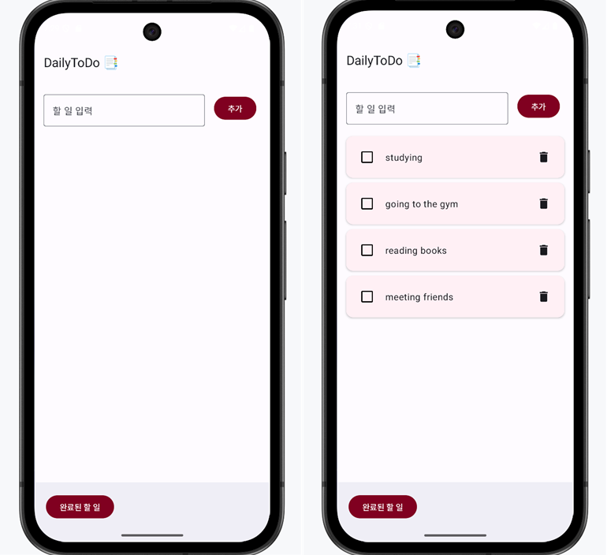
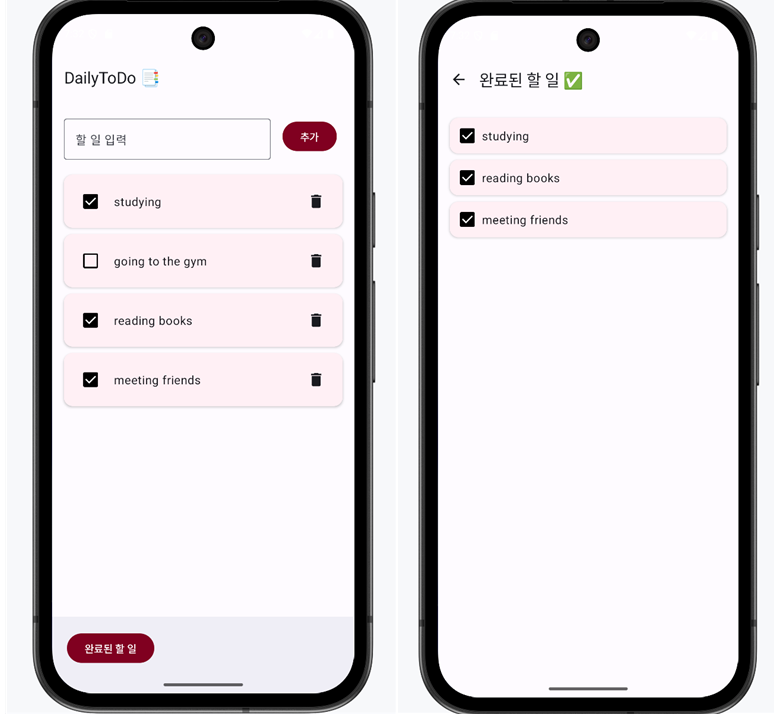

DailyToDo 앱 화면 구성 및 설명

<메인 화면 및 일정 추가 화면>

<체크 박스 후 완료된 할 일 화면>

이번 프로젝트에서는 Jetpack Compose를 활용하여 할 일 앱인 DailyToDo 앱을 구현했습니다.

교재와 피피티에서 배운 내용을 활용해 보고자 Scaffold를 이용해 상단바, 본문, 하단바로 화면 구조를 나누었고, 
할 일 입력과 목록 표시 기능을 Column과 Row 레이아웃으로 구성했습니다.
사용자가 입력한 할 일은 mutableStateOf와 mutableStateListOf를 활용하여 실시간으로 상태를 관리하고, 
Button과 Checkbox를 통해 추가, 완료 상태를 변경할 수 있습니다.
또한 Compose의 모디파이어(Modifier) 활용, 상태 관리, 레이아웃 구성, 화면 전환 등을 실제 앱에 적용해보았습니다.
Card, Button, Checkbox 등으로 색상과 스타일을 추가하여 UI/UX를 개선했습니다.
