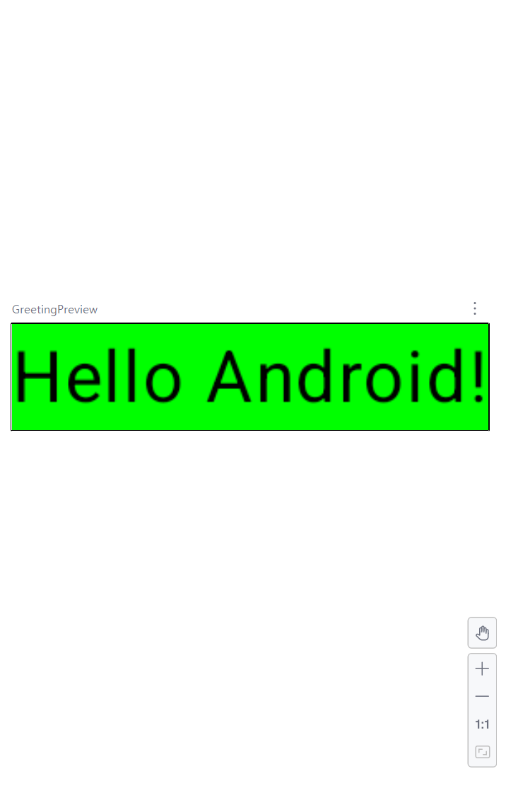
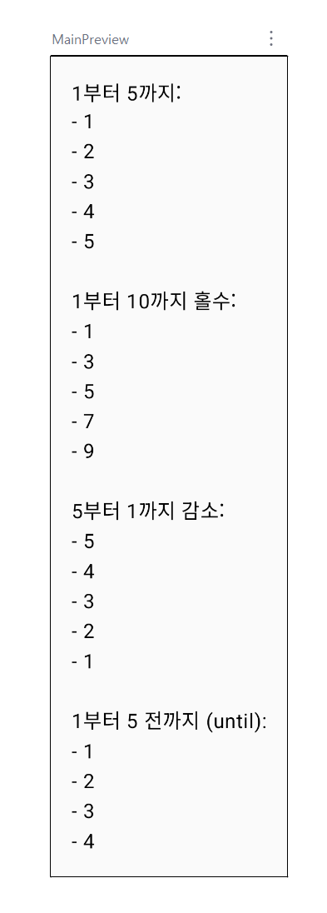
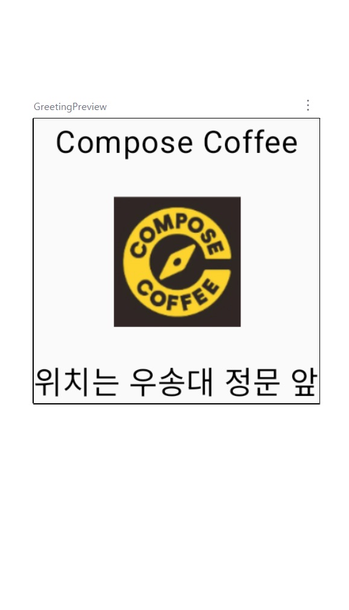
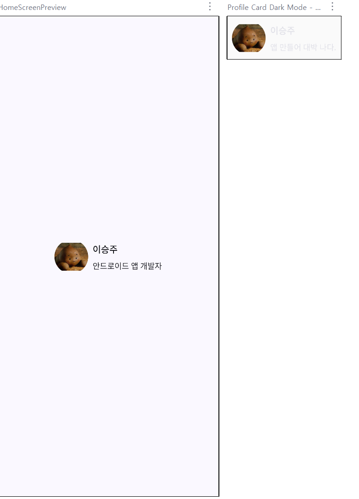
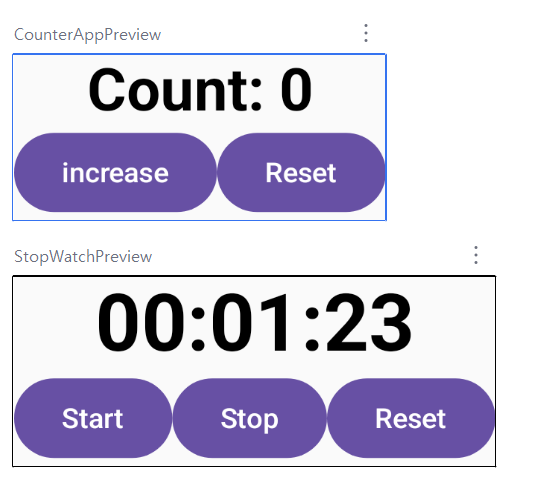
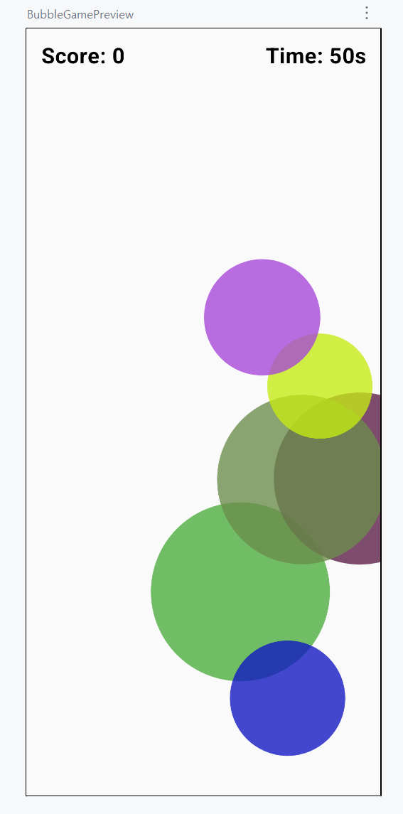

DailyToDo 앱 화면 구성 및 설명  

  

  

<메인 화면 및 일정 추가 화면>  
  

<체크 박스 후 완료된 할 일 화면>  
  

이번 프로젝트에서는 Jetpack Compose를 활용하여 할 일 앱인 DailyToDo 앱을 구현했습니다.  

교재와 피피티에서 배운 내용을 활용해 보고자 Scaffold를 이용해 상단바, 본문, 하단바로 화면 구조를 나누었고
할 일 입력과 목록 표시 기능을 Column과 Row 레이아웃으로 구성했습니다.  

사용자가 입력한 할 일은 mutableStateOf와 mutableStateListOf를 활용하여 실시간으로 상태를 관리하고
Button과 Checkbox를 통해 추가, 완료 상태를 변경할 수 있습니다.  

또한 Compose의 Modifier 활용, 상태 관리, 레이아웃 구성, 화면 전환 등을 실제 앱에 적용해보았습니다.
Card, Button, Checkbox 등으로 색상과 스타일을 추가하여 UI/UX를 개선했습니다.

Nav 함수를 사용해서 "완료된 할일" 버튼을 누르면 현재 화면에서 완료된 할 일 화면으로 자연스럽게 이동하도록 구현했습니다.
업로드한 사진과 같이 체크박스에 체크된 항목만 완료된 할 일 화면에 나타나는 것을 볼 수 있습니다.  
화면에 이모티콘을 추가해 기능이 직관적으로 보일 수 있도록 이모티콘 표에서 유니코드를 복사하여 붙여넣었습니다.

앱 DailyToDo를 추후 개선한다면 캘린더 기능 추가, 사용자 계정을 등록하여 할 일 기록을 저장, 시간 설정, 시간에 따른 할 일 알림 등의 기능을 생각해 볼 수 있습니다.  

 

week01  

 
  
week02

 

week03

 

week04

 

week05

 

week06
